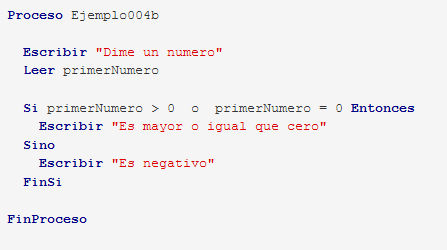

# U1T3 - Pseudocódigo: Comprobando condiciones (Si)
* **Ejercicio4-1:** Crea un programa que pida dos números al usuario y responda si son iguales o no lo son.
  
  

* **Ejercicio4-2:** Haz una variante del ejemplo 004b, usando el operador ">=".

* **Ejercicio4-3:** Crea un programa que pida un número al usuario y diga si es positivo, negativo o cero.

* **Ejercicio4-4:** Haz un programa que pida al usuario dos números y diga cuántos de ellos son positivos.

* **Ejercicio4-5:** Crea un programa que pida al usuario dos números y muestre su división si el segundo no es cero, o un mensaje de aviso en caso contrario.

* **Ejercicio4-6:** Prepara un programa que pida al usuario tres números y diga cuál es el mayor de los tres.