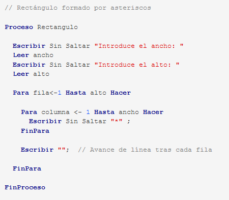

# U1T7 - Pseudocódigo: Repetir un cierto número de veces: Para

* **Ejercicio8-1:** Crea un programa que escriba los números del 5 al 15, ambos incluidos.

* **Ejercicio8-2:** Crea un programa que escriba los múltiplos del 3, desde el 3 hasta el 30, usando un paso de tamaño 3.

* **Ejercicio8-3:** Crea un programa que escriba los múltiplos del 3, desde el 3 hasta el 30, contando del uno al diez pero mostrando ese contador multiplicado por tres.

* **Ejercicio8-4:** Crea un programa que escriba los números del 20 al 10, descendiendo.

* **Ejercicio8-5:** Crea un programa que escriba la tabla de multiplicar del 5: desde "5 x 0 = 0" hasta "5 x 10 = 50"

* **Ejercicio8-6:** También se puede contar usando una orden "mientras" o una orden "repetir", si usas una variable como contador e incrementas *(o disminuyes)* su valor en cada pasada de forma manual. Compruébalo creando un programa que escriba los números del 1 al 15 usando "mientras" en vez de "para".



* **Ejercicio8-7:** A partir del ejemplo que dibuja un rectángulo de asteriscos, crea un que dibuje un cuadrado (deberá pedir sólo un dato, el lado, y ambas órdenes "para" deberán tener ese valor como límite).

* **Ejercicio8-8:** Dibuja un triángulo creciente de asteriscos, del tamaño que indique el usuario. Por ejemplo, si escoge 4, el resultado debería ser:
```` 
*
**
***
****
````