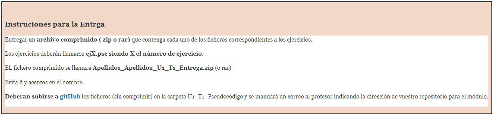

# U1_T1_Entregable_Programación_con_Pseudocódigo_PSEINT_2021
### UTILIZANDO LA APLICACIÓN PSEINT REALIZAD LOS SIGUIENTES EJERCICIOS

* **EJERCICIO 1 (ej1.psc)** 

Escribe un algoritmo que calcule el precio de un pedido de cierto producto la cantidad de producto que solicita el cliente. Para aclararlo, el precio de cada unidad depende de la cantidad de

> Las 100 primera unidades del pedido van a precio fijo. Siempre costarán 5.23€ cada una

> Las unidades entre la 101 y la 1000 (ambas incluidas) costarán 4.16€ cada una

> A partir de esa cantidad el precio será el 50% del precio original.

Por ejemplo:
````
Introduzca la cantidad de unidades: 90
El precio del pedido es: 470.70€

Introduzca la cantidad de unidades: 150
El precio del pedido es: 731€
````
* **EJERCICIO 2 (ej2.psc)** Escribe un programa que si le pasamos un entero nos devuelva ese entero al revés

Ejemplo:
````
Por favor, introduzca un número entero positivo: 123456
El número resultante es 654321
````
>**NOTA:** No se pueden utilizar funciones de texto de PseInt.

* **EJERCICIO 3 (ej3.psc)**

Nos han encargado realizar un programa que pinte un 8 por pantalla usando la letra M. Se pide al usuario la altura, que debe ser un número entero impar mayor o igual que 5. Si el número introducido no es correcto, el programa deberá mostrar un mensaje de error y volver a solicitarlo. A continuación se muestran algunos ejemplos.

La anchura de la figura siempre será de 6 caracteres.

Ejemplo 1:
````
Por favor, introduzca la altura (número impar mayor o igual a 5): 8
La altura introducida no es correcta
````
Ejemplo 2:
````
Por favor, introduzca la altura (número impar mayor o igual a 5): 3
La altura introducida no es correcta
````
Ejemplo 3:
````
Por favor, introduzca la altura (número impar mayor o igual a 5): 7
MMMMMM
M    M
M    M
MMMMMM
M    M
M    M
MMMMMM
````
* **EJERCICIO 4 (ej4.psc)**

Realiza un programa que calcule el máximo, el mínimo y la media de una serie de números enteros positivos introducidos por teclado. El programa terminará cuando el usuario introduzca un número primo. Este último número no se tendrá en cuenta en los cálculos. El programa debe indicar también cuántos números ha introducido el usuario (sin contar el primo que sirve para salir).

Ejemplo:
````
Por favor, vaya introduciendo números enteros positivos. Para terminar, introduzca un número primo:
>6
>8
>15
>12
>23
Ha introducido 4 números no primos.
Máximo: 15
Mínimo: 6
Media: 10.25
````

