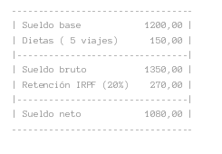

* **Ejercicio 1:**
Escribe un programa que pida dos números por teclado y que luego mezcle en dos números diferentes los dígitos pares y los impares. Se van comprobando los dígitos de la siguiente manera: primer dígito del primer número, primer dígito del segundo número, segundo dígito del primer número, segundo dígito del segundo número, tercer dígito del primer número... Para facilitar el ejercicio, podemos suponer que el usuario introducirá dos números de la misma longitud y que siempre habrá al menos un dígito par y uno impar. Usa long en lugar de int donde sea necesario para admitir números largos.

Ejemplo 1:
````
Por favor, introduzca un número: 9402
Introduzca otro número: 6782
El número formado por los dígitos pares es 640822
El número formado por los dígitos impares es 97
````
Ejemplo 2:
````
Por favor, introduzca un número: 137
Introduzca otro número: 909
El número formado por los dígitos pares es 0
El número formado por los dígitos impares es 19379
````
* **Ejercicio 2:**
Escribe un programa que, dado un número entero, diga cuáles son y cuánto suman los dígitos pares por un lado, y los impares por otro. Los dígitos  
se deben mostrar en orden, de izquierda a derecha. Usa long en lugar de int  donde sea necesario para admitir números largos.

Ejemplo 1:
````
Por favor, introduzca un número entero positivo: 94026782
Dígitos pares: 4 0 2 6 8 2
Dígitos impares: 9 7
Suma de los dígitos pares: 22
Suma de los dígitos impares: 16
````
Ejemplo 2:
````
Por favor, introduzca un número entero positivo: 31779
Dígitos pares:
Dígitos impares: 3 1 7 7 9
Suma de los dígitos pares: 0
Suma de los dígitos impares: 27
````
Ejemplo 3:
````
Por favor, introduzca un número entero positivo: 2404
Dígitos pares: 2 4 0 4
Dígitos impares: 
Suma de los dígitos pares: 10
Suma de los dígitos impares: 0
````
>NOTA: NO SE PUEDEN UTILIZAR FUNCIONES DE CADENAS

* **Ejercicio 3:**
Realiza un programa que pinte un reloj de arena relleno hecho de asteriscos. El programa debe pedir la altura. Se debe comprobar que la altura sea un número impar mayor o igual a 3, en caso contrario se debe mostrar un mensaje de error.

Ejemplo 1:
````
Por favor, introduzca la altura del reloj de arena: 5
*****
 ***
  *
 ***
*****
````
Ejemplo 2:
````
Por favor, introduzca la altura del reloj de arena: 3
 ***
  *
 ***
````


Ejemplo 3:
````
Por favor, introduzca la altura del reloj de arena: 7
*******
 *****
  ***
   *
  ***
 *****
*******
````


* **Ejercicio 4:**
Escribe un programa que genere la nómina (bien desglosada) de un empleado según las siguientes condiciones:


   * Se pregunta el cargo del empleado *(1 - Prog. junior, 2 - Prog. senior, 3 - Jefe de proyecto)*, los días que ha estado de viaje visitando clientes durante el mes y su estado civil *(1 - Soltero, 2 - Casado)*.
   * El sueldo base según el cargo es de 950, 1200 y 1600 euros según si se trata de un prog. junior, un prog. senior o un jefe de proyecto
respectivamente.
   * Por cada día de viaje visitando clientes se pagan 30 euros extra en concepto de dietas. Al sueldo neto hay que restarle el IRPF, que será de
un 25% en caso de estar soltero y un 20% en caso de estar casado.<br>
