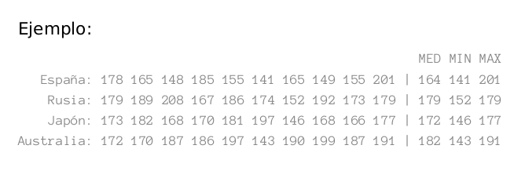

# U3 - Examen 2021 MAÑANA ROJO
* **Ejercicio 1**

Define la función esta  con la siguiente cabecera:

>public static boolean esta(int[] vector, int num)

Que nos devuelva si un elemento está en un vector(array) unidimensional.

Usar dicho elemente para construir la siguiente función:

>public static int[] unirSinRepetidos(int v1[],int[] v2)

Que una los dos vectores pero sin elementos repetidos. Usar dicha función en el método main mostrando el vector resultado por pantalla.

Ejemplo1:
````
v1 = {1,2,3}

v2 = {4,5,6}
````
El resultado de unirSinRepetidos() será:
````
{1,2,3,4,5,6}
````
Ejemplo2:
````
v1 = {1,2,3}

v2 = {3,2,5}
````
El resultado de unirSinRepetidos() será:
````
{1,2,3,5}
````
* **Ejercicio 2**

Define la función convierteArrayEnString con la siguiente cabecera:
>public static String convierteArrayEnString(int[] a)

Esta función toma como parámetro un array que contiene números y devuelve
una cadena de caracteres con esos números. 
>Por ejemplo, si a = { }, con-
vierteArrayEnString(a) devuelve “”; si a = { 8 }, convierteArrayEnString(a)
devuelve “8”; si a = { 6, 2, 5, 0, 1 }, convierteArrayEnString(a) devuelve
“62501”.

Usar dicha función en el método main mostrando el resultado por pantalla.

* **Ejercicio 3**

Realiza un programa que calcule la estatura media, mínima y máxima en centímetros de personas de diferentes países. El array que contiene los nombres de los paises es el siguiente: ***pais = {“España”, “Rusia”, “Japón”, “Australia”}***. Los datos sobre las estaturas se deben simular mediante un
array de 4 filas por 10 columnas con números aleatorios generados al azar entre 140 y 210. Los decimales de la media se pueden despreciar. Los nombres de los países se deben mostrar utilizando el array de países (no se pueden escribir directamente).
;


* **Ejercicio 4**

Crear una función unirMatrices que reciba dos matrices bidimensionales de cadenas y devuelva la unión de las dos matrices.

Si la matrices no tiene la misma dimensión deberá devolver un vector bidimensional vacio.

Ejemplo1:
````
HOLA	PERRO	C++
ADIOS	GATO	PYTHON
HASTA LUEGO	VACA	JAVA


BD	SOBRESALIENTE	PEPE
LM	NOTABLE	MANUEL
PROG	APROBADO	ROSA
````
El resultado de unir estas dos matrices será:
````
HOLA	PERRO	C++	BD	SOBRESALIENTE	PEPE
ADIOS	GATO	PYTHON	LM	NOTABLE	MANUEL
HASTA LUEGO	VACA	JAVA	PROG	APROBADO	ROSA
````
Ejemplo2:
````
HOLA	PERRO	C++
ADIOS	GATO	PYTHON
HASTA LUEGO	VACA	JAVA


BD	SOBRESALIENTE
LM	NOTABLE
PROG	APROBADO
````
El resultado de unir estas dos matrices será:
````
{}
````