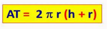
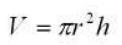

# U3: Tarea 1 - Funciones

En todos estos ejercicios, debes diseñar la función, y llamarla desde la main con los valores que estimes oportunos para probarla.

* **Actividad 1:** Diseñar una función eco() a la que se le pasa como parámetro un número n, y muestra por pantalla n veces el mensaje "Eco..."

* **Actividad 2:** Diseñar una  función a la que se le pasen dos enteros y muestre todos los números comprendidos entre ellos.

* **Actividad 3:** Realizar una función que calcule y muestre el área o el volumen de un cilindro, según se especifique. Para distinguir un caso de otro se le pasará un número 1 (para área) o 2 (para volumen). Además, hemos de pasarle a la función el radio de la base y la altura.

>Área total: 
> 
volumen: 
>

* **Actividad 4:** Diseñar una función que reciba como parámetros dos números enteros y que devuelva el mayor de los dos.

* **Actividad 5:** Repetir el ejercicio anterior con una versión que calcule el máximo de 3 números. Piensa un poco, no hagas el algoritmo de comparación de los 3 números desde cero.

* **Actividad 6:** Crear una función que, mediante un booleano, indique si el carácter que se pasa como parámetro de entrada corresponde con una vocal.

* **Actividad 7:** Diseñar una función que nos diga si un número es primo.

* **Actividad 8:** Escribir una función a la que se le pase un número entero y devuelva el número de divisores primos que tiene.

* **Actividad 9:** Implementar la función divisoresPrimos() que muestra, por consola, todos los divisores primos del número que se le pasa como parámetro

* **Actividad 10:** Escribir una función que decida si dos números enteros positivos son amigos. Dos números son amigos si la suma de los divisores propios (distinto de él mismo) del primer número es igual al segundo número, y viceversa. 

Ejemplos: 

>(220 - 284) 
>(1184 - 1210)

* **Actividad 11:** Realizar una función que calcule a elevado a n, donde a es real, y n entero no negativo. Realizar una versión iterativa y otra recursiva.

* **Actividad 12:** Calcular el factorial de n recursivamente. Recordar que por definición, el factorial de 0 es 1.